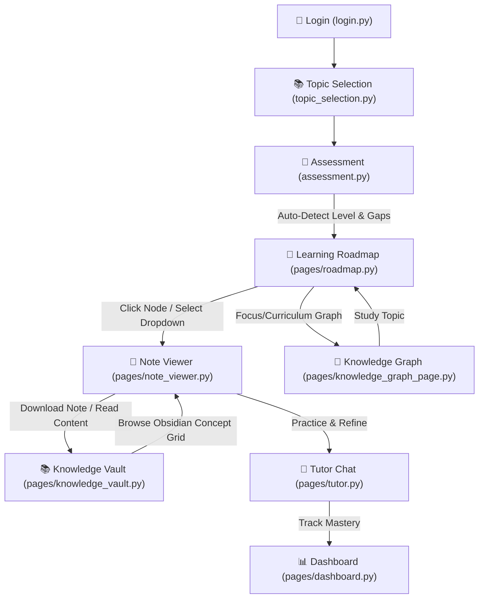

# 🧠 Synapse AI Tutor — Implementation Documentation

Welcome to the official implementation documentation for the **Synapse AI Tutor** upgrade. This document outlines the system architecture, file changes, backend logic, and frontend components introduced to create a highly personalized, visually stunning, and interactive learning experience.

---

## 🏗️ Overall System Flow & Navigation

The upgraded application establishes a fluid, logical loop that takes the student from initial assessment all the way to concept mastery and self-directed study:



---

## 🚀 Key Features Implemented

### 1. Interactive Knowledge Graph Page
* **Visual Representation**: An interactive network graph built using **Cytoscape.js** (loaded lightweight via CDN).
* **Two Specialized Views**:
  1. **🌐 Full Curriculum**: Displays all 10 topics, their prerequisite connections (solid lines), and related topic relationships (dashed lines).
  2. **🎯 Topic View**: A focused graph centering on the currently selected topic, showing its prerequisites, key concepts (teaches relationships), and related subjects.
* **Color-Coded Mastery States**:
  * **Mastered (Green)**: Score $\ge 76\%$.
  * **In Progress (Yellow/Orange)**: Score $1\% - 75\%$.
  * **Not Started (Dark Grey)**: Score $0\%$.
  * **Prerequisites (Light Grey)**: Core prerequisite nodes.
* **Topic Explorer Panel**: Located below the graph, showing progress bars and featuring quick "Study Topic" buttons that direct the student to their learning roadmap.

### 2. Roadmap.sh-style Personalized Learning Path
* **Dagre Layout Tree**: A tree diagram using Cytoscape's **Dagre layout** engine showing prerequisites, knowledge gaps, core concepts, and advanced extensions grouped cleanly.
* **Interactive Node States**:
  * **🔒 Locked**: Prerequisites not completed yet.
  * **🟡 Current**: Active learning node.
  * **✅ Done**: Completed nodes marked with a checkmark.
* **Auto-generated Notes**: Generates complete note pages for every node on the path upon initialization.
* **Streamlit Controls**: Dropdown and buttons to easily select nodes and open them directly in the Note Viewer page.

### 3. Dedicated Note Viewer Page
* **Sequential Navigation**: Prev / Next buttons to move page-by-page along the active learning roadmap.
* **Breadcrumb Header**: Clean roadmap indicators showing current progress (e.g., `Step 3/9`).
* **Interactive Elements**:
  * **⬇ Download .md**: Allows students to download full notes locally.
  * **💬 Tutor Chat**: Fast redirect to chat with the AI tutor for deeper explanations.
  * **📚 Knowledge Vault**: Easy access to the card library.

### 4. Obsidian-style Knowledge Vault
* **Grid Layout**: Responsive 3-column card grid summarizing all generated notes.
* **Self-Parsing Tags**: Dynamically reads notes to extract "Connected Concepts" and renders them as mini-tags.
* **Real-time Filter**: Instant search box filtering titles or content.
* **Download Integration**: Fast download buttons direct from the grid interface.

### 5. High-Performance Groq API Integration
* **Cloud-Inference Upgrade**: Replaced the local Ollama backend with the cloud-hosted **Groq SDK** for lightning-fast answers ($\approx 2-3$ seconds per query).
* **Adaptive Prompts**: Generates explanations, analogies, and code snippets tailored to Beginner, Intermediate, or Advanced levels.
* **Offline Fallbacks**: Automatically falls back to curated offline templates if the API key is missing or the network goes down.

---

## 📁 Implementation File Reference

Here are the detailed changes introduced across the codebase:

### ⚙️ System Config & Files Added
* **[.env](file:///c:/simran/3rd%20year/6th%20sem/gen-ai/hackathon/Team-A2/synapse_ai_tutor/.env)**: Secure template file holding the `GROQ_API_KEY`.
* **[.gitignore](file:///c:/simran/3rd%20year/6th%20sem/gen-ai/hackathon/Team-A2/synapse_ai_tutor/.gitignore)**: Prevents staging of local caching binaries, custom data files, `.env` file, and user markdown notes.
* **[requirements.txt](file:///c:/simran/3rd%20year/6th%20sem/gen-ai/hackathon/Team-A2/synapse_ai_tutor/requirements.txt)**: Added `groq`, `python-dotenv`, and `pyvis` packages.

### 🛠️ Backend Core Logic
* **[llm_client.py](file:///c:/simran/3rd%20year/6th%20sem/gen-ai/hackathon/Team-A2/synapse_ai_tutor/backend/llm_client.py)**: Loads variables from `.env`. Implements the Groq SDK client. Provides full level-adaptive prompt generation and fallback markdown creation.
* **[note_generator.py](file:///c:/simran/3rd%20year/6th%20sem/gen-ai/hackathon/Team-A2/synapse_ai_tutor/backend/note_generator.py)**: Manages RAG-augmented note construction. Saves notes as individual `.md` files under `data/notes/{username}/` and updates meta-registries in `progress.json`.
* **[roadmap_generator.py](file:///c:/simran/3rd%20year/6th%20sem/gen-ai/hackathon/Team-A2/synapse_ai_tutor/backend/roadmap_generator.py)**: Tracks sequence flow (prereqs $\rightarrow$ gaps $\rightarrow$ core $\rightarrow$ advanced). Persists step completion states.
* **[knowledge_graph.py](file:///c:/simran/3rd%20year/6th%20sem/gen-ai/hackathon/Team-A2/synapse_ai_tutor/backend/knowledge_graph.py)**: Assembles node/edge arrays from prerequisite maps. Compiles self-contained HTML pages embedded with Cytoscape.js.

### 🖥️ Page Components & Routing
* **[app.py](file:///c:/simran/3rd%20year/6th%20sem/gen-ai/hackathon/Team-A2/synapse_ai_tutor/app.py)**: Setup new session states. Added "Roadmap", "Knowledge Vault", and "Knowledge Graph" into the sidebar menu and handles routing.
* **[assessment.py](file:///c:/simran/3rd%20year/6th%20sem/gen-ai/hackathon/Team-A2/synapse_ai_tutor/pages/assessment.py)**: Integrated a "View Roadmap" redirect button on completing the assessment.
* **[roadmap.py](file:///c:/simran/3rd%20year/6th%20sem/gen-ai/hackathon/Team-A2/synapse_ai_tutor/pages/roadmap.py)**: Renders the personalized timeline graph, progress bar, note generator trigger, and dropdown viewer.
* **[note_viewer.py](file:///c:/simran/3rd%20year/6th%20sem/gen-ai/hackathon/Team-A2/synapse_ai_tutor/pages/note_viewer.py)**: Displays notes, handles step navigation, and links to download options.
* **[knowledge_vault.py](file:///c:/simran/3rd%20year/6th%20sem/gen-ai/hackathon/Team-A2/synapse_ai_tutor/pages/knowledge_vault.py)**: Manages the search filters, Obsidian grids, and full-screen card reading modal.
* **[knowledge_graph_page.py](file:///c:/simran/3rd%20year/6th%20sem/gen-ai/hackathon/Team-A2/synapse_ai_tutor/pages/knowledge_graph_page.py)**: Connects tabs for Full vs Topic views and topic breakdowns.

---

## 🎨 Visual System & UI Aesthetics

To align with modern premium standards, we utilized the following design patterns:
1. **Typography**: Implemented clean browser-agnostic font weight scale (`Inter`).
2. **Glassmorphism Panels**: Embedded Streamlit layout components wrapped with custom CSS:
   ```css
   border: 1px solid rgba(108,99,255,0.12);
   background: linear-gradient(145deg, #14142E, #1A1A3E);
   border-radius: 14px;
   ```
3. **Responsive Cards**: Obsidian-style visual cards equipped with hover-scaling (`translateY(-3px)`) and glows (`box-shadow: 0 0 20px rgba(108,99,255,0.15)`).
4. **Theme Alignment**: Color palettes built around deep slate-blue backgrounds (`#0A0A1A`), purple main themes (`#6C63FF`), vibrant cyan accents (`#00D2FF`), and functional feedback colors (emerald for success, orange for active items).
